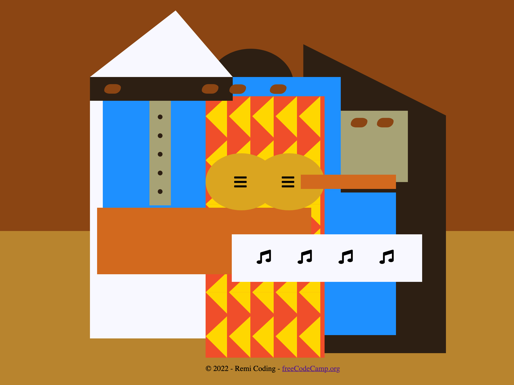

# Picasso Painting

This repository contains the HTML and CSS for the **Learn Intermediate CSS by Building a Picasso Painting** course by [freeCodeCamp](https://www.freecodecamp.org/learn/2022/responsive-web-design/).

The intermediate CSS techniques applied in this project include SVG icons, CSS positioning, and a review of other CSS skills learned previously.

The `index.html` file contains HTML tags and appropriate classes to use to structure and manipulate the elements on the page.

The `css/styles.css` file is used with an emphasis on positioning of elements on the page relative to each other and their parent container.

The page can be viewed here: [Picasso Paintaing](https://remicoding.github.io/picasso-painting-page/)

For your convenience, here is a screenshot of the page:

